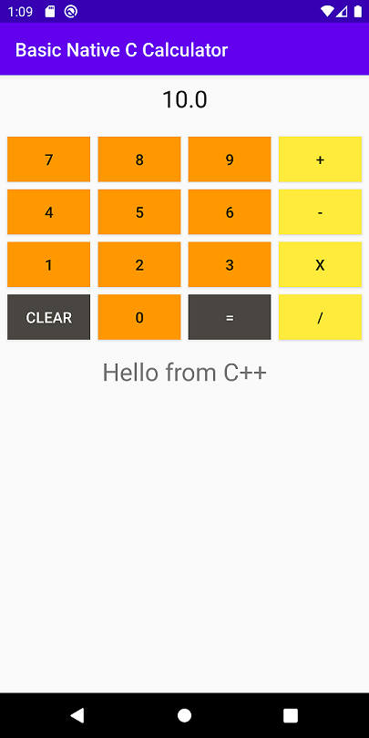

# NativeCalc - NDK - JNI

Example project using Android NDK and JNI to implements a basic calculator with the operation functions written in C++ code.

## Description

Example JNI function in c++ to added float numbers:

```
// Addition function
extern "C" JNIEXPORT jfloat JNICALL
Java_com_mapx_kosten_basicnativeccalculator_MainActivity_add( JNIEnv *env, jobject, jfloat x, jfloat y) {
    return x + y;
}

```

The name of the JNI function follows the structure: *PackageName_ActivityName_MethodName*

Then we declare in the activity the Kotlin external method with the same name as used in the *native-lib.cpp* file.

```
external fun add(x: Float, y: Float): Float
```





